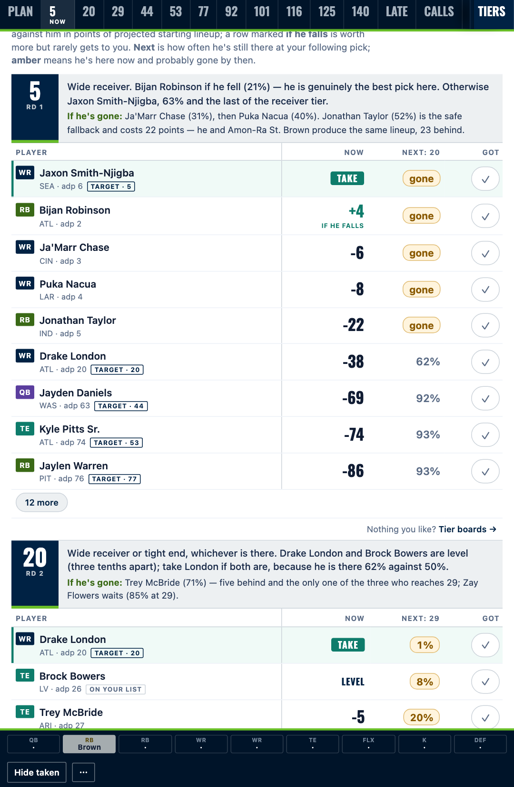
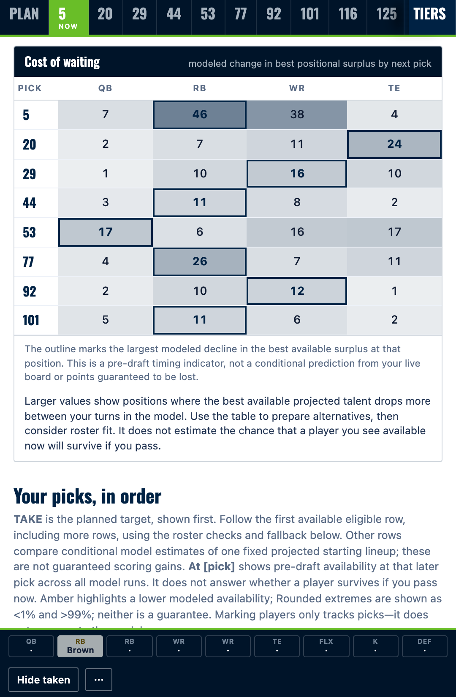
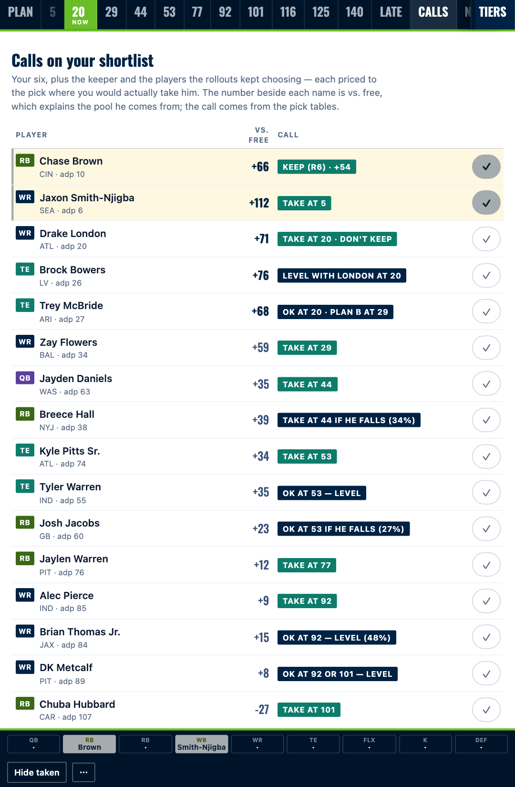
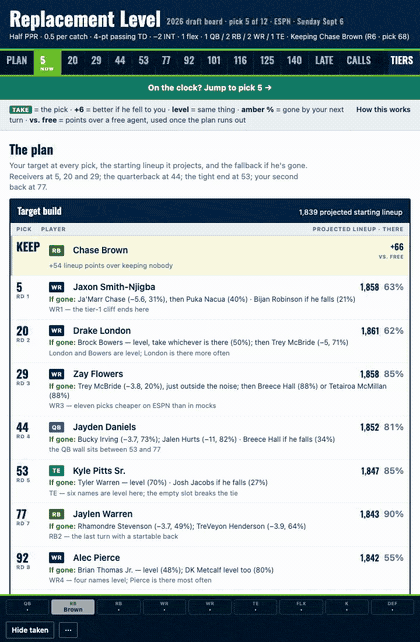

<h1 align="center">Fantasy Draft Analyst</h1>

<p align="center"><b>Ranks every pick by simulating the rest of your draft.</b><br>
A free, open-source Claude skill that answers the only question that matters on the clock — <i>which of these players leaves me with the best team in January?</i> — and shows its work.</p>

<p align="center">
<a href="#quick-start">Quick start</a> · <a href="#see-it-in-action">See it in action</a> · <a href="#the-receipt">The receipt</a> · <a href="#how-it-thinks">How it thinks</a> · <a href="#what-it-handles">Scope</a> · <a href="docs/how-it-works.md">The data science</a>
</p>

<p align="center"></p>

<p align="center"><sub>MIT licensed · standard library + PyYAML · works in Claude Code, the desktop app, claude.ai, or pasted into any assistant</sub></p>

---

## See it in action

**On the clock, one number per player.** `TAKE` is the pick. Every other row shows what it costs you against him, in points of final starting lineup — and `level` means the simulation genuinely can't tell them apart.

<p align="center"></p>

**When to take which position, measured.** What one more turn of waiting costs you at each position. The outlined cell is the one about to run out.

<p align="center"></p>

**Your shortlist, pressure-tested.** Every player you like, with the case for, the honest risk, what the betting market implies, and a verdict with a price.

<p align="center"></p>

**A board built for a phone with someone yelling at you.** Tap a row when he's taken, tap ✓ when he's yours — your lineup fills in, the nav jumps to your next pick, and a reload loses nothing.

<p align="center"></p>

---

## The receipt

[`examples/sample-league/`](examples/sample-league/) is a complete run on a 12-team ESPN half-PPR keeper league — real players, live data, every input and intermediate committed. Reproduce it with one command.

```bash
cd examples/sample-league
python3 ../../skills/fantasy-draft-analyst/scripts/draft_sim.py \
    --league league.yaml --players players.csv --sims 1500 \
    --pick-values --keeper-scenarios --out sim.json
```

Same seed, same numbers, every time. [`analysis.md`](examples/sample-league/analysis.md) is the write-up · [`draft-board.html`](examples/sample-league/draft-board.html) is the board · [`RUNLOG.md`](examples/sample-league/RUNLOG.md) says where every number came from.

Three things it found in that run, which is roughly what it finds every time:

- **Four of the six players the user liked had a premise that was wrong.** The coach had publicly said the opposite about one player's role. A "TE2 finish" was TE6 per game, with three of his five touchdowns in one week.
- **The 25-point tight-end cliff everyone drafts around didn't matter.** The elite tight end and the elite receiver at pick 20 produce the same projected lineup to within half a point, because the replacement tight end is 85% likely to still be there four rounds later.
- **The keeper that felt right was 40 points worse than the one the math chose.** Keeping the round-6 running back who became a first-round player is worth 54 points of starting lineup over keeping nobody — 3.2 a week, for one pick.

---

## Quick start

**Claude Code**

```bash
git clone https://github.com/nicodeguyo/fantasy-draft-analyst.git
mkdir -p ~/.claude/skills && cp -r fantasy-draft-analyst/skills/fantasy-draft-analyst ~/.claude/skills/
pip install pyyaml
```

Then `/fantasy-draft-analyst`, or just describe your draft. As a plugin instead: `/plugin marketplace add nicodeguyo/fantasy-draft-analyst`, then `/plugin install fantasy-draft-analyst@fantasy-draft-analyst`.

**Claude.ai or the desktop app** — download [`dist/fantasy-draft-analyst.zip`](dist/fantasy-draft-analyst.zip), then **Customize → Skills → + → Upload a skill**. Turn on **Settings → Capabilities → Code execution** so the simulator can run.

**Anywhere else** — paste [`prompt/fantasy-draft-analyst-prompt.md`](prompt/fantasy-draft-analyst-prompt.md) into ChatGPT, Gemini or any assistant with browsing. Same reasoning, done by hand instead of simulated.

Then say something like:

> *"I'm pick 7 in a 12-team half-PPR keeper league on Yahoo. Here's my roster. Who do I keep, who do I target at each pick, and build me a board for my phone."*

Full instructions per surface: [docs/install.md](docs/install.md).

---

## How it thinks

**Simulate the rest of the draft, then look at the lineup.** For each player in front of you, the simulator plants him at your pick, plays the remaining hundred-odd picks out, and adds up your best legal starting lineup — two hundred times, every candidate facing the same drafts. That number is **pick value**. The board marks the player it recommends `TAKE` and prices everyone else against him: *London TAKE · Bowers level · Collins −14*. Fourteen points across a season is under one a week, and knowing a gap is small is worth as much as knowing which way it points.

**Which is why replacement level is now an explanation, not the ranking.** Value-based drafting scores a player as projection minus the worst starter at his position. It's a good way to see which pools are deep, and it's still the tier boards' column. But that baseline is *chosen*, not measured, and this year it lands on a cliff: RB37 projects 132, RB40 projects 111. Move it three ranks — well inside honest disagreement — and every back on the board gains twenty points.

That's not hypothetical. **Two defensible versions of this tool drafted eight running backs and receivers-first from identical projections.** Nothing about the players changed. When the answer swings that far on a number nobody can pin down, stop needing the number. [The full story, with the receipts →](docs/how-it-works.md)

**Cost of waiting, not "RB early."** For each of your picks, what one more turn costs at each position: 47 points on a running back at pick 5 in the example league, 11 by pick 44, never more than seven on a quarterback until round 5. Both halves of that subtraction carry the same replacement level, so it cancels — override it by ±20 ranks and the cells move by at most 4 points, where the surplus levels they're built from move 73.

**Price the room you're actually in.** ESPN drafts elite quarterbacks and tight ends a round early and lets receivers slide; Sleeper takes the top two or three quarterbacks very early and everyone else very late; Underdog inflates the late rounds. The skill fetches ADP for *your* platform and re-runs the availability model on it.

**And it says what it's worth.** Three drafters, 800 identical simulated drafts, only your seat
changes: autopicking off ADP finishes on 1,729 projected starting points, following this board
finishes on 1,838 — **+109, about six and a half a week** — and the board's spread is a quarter of
autodraft's (±19 against ±81), so it is far more consistent as well as better. Reproduce it with
`scripts/compare_policies.py`. That is the simulator grading itself under its own assumptions, not a
backtest against real drafts, and the repo says so.

**Say the bear case out loud.** Every verdict comes with the strongest argument against it and the one fact that would change it. Every number carries a standard error, and two players inside the noise are reported as level rather than ranked. Where the tool's own recommendation underperforms its own default policy — it does, by about a point and a half a week — [the docs say so and say why](skills/fantasy-draft-analyst/references/methodology.md).

---

## What it handles

| | |
|---|---|
| **Formats** | Snake and linear drafts, any number of teams. Redraft and keeper. |
| **Keeper rules** | Same round, round minus one, round minus two, fixed round, escalating. Waiver-pickup eligibility, traded players, published keeper lists or a modelled draw. |
| **Scoring** | Standard / half / full PPR, passing-TD value, interception penalty, rush and receiving TD values, bonuses, TE premium. |
| **Lineups** | Any combination of QB / RB / WR / TE / K / DEF, any number of FLEX, and superflex. |
| **Platforms** | ESPN, Yahoo, Sleeper, CBS, NFL.com, Underdog, FFPC — anywhere with a public ADP. |

**Auction** gets a surplus-to-dollars conversion in the methodology, not a bidding engine — the simulator drafts picks, and it will tell you so rather than pretend. **Dynasty is out of scope**, and deliberately: roster value there is dominated by age curves, contract years and rookie-pick capital, which is a different model rather than a different setting. Use a dynasty-specific process.

---

## Under the hood

```
skills/fantasy-draft-analyst/
├── SKILL.md                    the workflow: intake → data → projections → rollouts → verdict → board
├── league.example.yaml         every league setting, documented
├── references/
│   ├── methodology.md          the reasoning — read this one first
│   ├── metrics.md              what predicts, what doesn't, how to weight it, how to use Vegas
│   ├── data-sources.md         verified URLs per platform, fetch order, freshness rules
│   ├── keeper-rules.md         the taxonomy of keeper rules and how each changes the math
│   ├── draft-slot-playbook.md  early / middle / late slots, turn by turn
│   ├── output-spec.md          the output contract and the board's notes schema
│   └── glossary.md
└── scripts/
    ├── fetch_adp.py            ADP from FantasyFootballCalculator, ESPN, Footballguys, Sleeper
    ├── scoring.py              stat lines → points in your scoring
    ├── merge_adp.py            reprice a player pool with your platform's ADP
    ├── draft_sim.py            the simulator: pick values, plan path, cost of waiting, keeper scenarios
    └── build_board.py          the draft-day board (32 NFL team palettes built in)
```

A full run on a 12-team league takes about six minutes; `--rollouts 60` gives a rough answer in under two. Standard library plus PyYAML — no paid data, no API keys.

---

## FAQ

**Redraft, no keepers?** Yes — `keepers.count: 0`, or just say so.

**How current is the data?** As current as the day you run it. ADP, projections, news and betting lines are fetched at run time and every source is date-stamped in the appendix. Re-run the day before your draft.

**Is it right?** It's a model with stated assumptions, not an oracle. It names the assumption everything depends on — now the projections themselves, since v2 removed the replacement-level dependency — so you can disagree with it *before* the draft instead of during. Fantasy football is high-variance; a good process loses sometimes.

**Can I share the board with my league?** You can. Whether you *should* is a question for your keeper strategy.

**Why is it free?** Because the tooling to build things like this is now available to anyone, and the best way to show that is to give one away. If it wins you a league, tell someone.

---

## Contributing

Issues and PRs welcome — especially verified data sources, platform ADP quirks with evidence, keeper-rule variants the taxonomy doesn't cover, and a better rest-of-draft policy inside the rollouts (the weakest link, and [we say why](CHANGELOG.md)). See [CONTRIBUTING.md](CONTRIBUTING.md).

## Credits

Built by Nico Neugebauer ([@nicodeguyo](https://github.com/nicodeguyo)) with Claude, for his own 14-team keeper league, then generalized. The projections, simulations and opinions are the model's; the players are real; the leagues in the examples are not. Not affiliated with the NFL, ESPN, Yahoo, Sleeper or any sportsbook. Data sources belong to their owners — read their terms.

MIT License. Use it, fork it, win your league.
