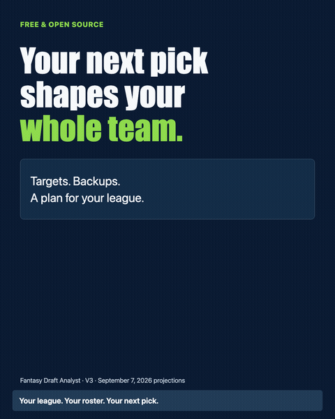

<h1 align="center">Fantasy Draft Analyst</h1>
<p align="center"><b>Your league. Your roster. Your next pick.</b></p>
<p align="center">Make your next fantasy football pick with the evidence and the tradeoffs in view.</p>
<p align="center"><a href="#setup"><b>Choose your setup</b></a> · <a href="https://nicodeguyo.github.io/fantasy-draft-analyst/#compare">Explore the v3 example</a> · <a href="https://github.com/nicodeguyo/fantasy-draft-analyst/raw/refs/heads/main/dist/fantasy-draft-analyst.zip">Download v3.0.0</a></p>
<p align="center"><a href="https://nicodeguyo.github.io/fantasy-draft-analyst/#compare"></a></p>

A free, open-source skill for AI assistants. Compare available players using your scoring, multiple projection sources, and the team you’re building. See the recommendation, the alternatives, and what could change the call.

**Your next pick shapes your whole team.** Prepare targets and backups before draft night, or run a local live session that recalculates advice as you record picks.

## Setup

A *skill* is a package of instructions and scripts you give an assistant. Choose the experience you want:

| | Prepare your draft plan | Get local live advice |
|---|---|---|
| Get | Researched targets, backups, keeper comparisons, and a saved HTML board | Updated shortlists, roster tradeoffs, and saved decision records |
| Run with | Claude with Skills and code execution, or a compatible coding assistant | Python 3.10+ on your computer; a coding assistant can help set up |
| Record picks | Marks on a downloaded board **do not recalculate** its advice | Enter or import actual picks; recommendations recalculate |
| Start | [Preparation setup](docs/install.md#prepare-in-claude) | [Local live setup](docs/install.md#local-live-advice) |

The Claude browser preparation route needs no local Python installation. Live mode needs a running local Python process and a browser on that computer. Neither mode automatically syncs with ESPN, Yahoo, or Sleeper or submits picks. The code is free; assistant accounts and usage may cost money.

After installing, start with:

```text
Use the fantasy draft analyst skill to help me prepare for my fantasy draft.
Ask me for my league settings, confirm them with me, then build a sourced
plan with targets and alternatives. Show missing data and assumptions.
```

Already have your settings? [Use the complete league template](docs/install.md#league-template). Other routes: [Claude Code](docs/install.md#claude-code) · [Codex or another coding assistant](docs/install.md#codex-or-another-coding-assistant) · [No code execution](docs/install.md#any-assistant-without-code-execution).

## What it helps you decide

- **Which source should I trust?** Inspect which projection inputs support an estimate, where they disagree, and what is missing.
- **How does this player fit my team?** Compare usable starting-lineup contribution and modeled bench coverage under your scoring and roster requirements.
- **My target is gone. Who is next?** Record the pick in local live mode and recalculate from the actual available pool.
- **Can I afford to wait?** Inspect possible next-turn choices under declared opponent assumptions. Live mode’s eight scenarios are illustrative, not calibrated survival odds.
- **What could change the recommendation?** Examine projection stress cases and ask the assistant to research dated injury, role, and usage evidence.
- **Is my keeper worth the pick?** Compare eligible options and keeping nobody, including their round costs. Supports zero or one keeper per team.

## See v3 work

In the [public walkthrough](https://nicodeguyo.github.io/fantasy-draft-analyst/#compare), a fictional 12-team half-PPR manager has Jonathan Taylor. Pick 19 takes George Pickens; the v3 engine then recommends Kenneth Walker III at pick 20, followed by Rashee Rice and Chris Olave.

**Why take Walker now?** If you take Rice at 20, Walker reaches pick 29 in 1.4% of the simulated paths. Take Walker instead, and Rice reaches 29 in 30.9%. The Walker-first path averages **+7.5 projected points across the next two selections** (800 simulations per path).

Fictional 12-team half-PPR draft using saved September 7 projections. [Explore the inputs and method](docs/site/README.md).

[Watch the narrated tour](docs/media/v3-walkthrough.mp4) · [Saved recommendation packets](docs/site/v3-demo.json)

## Your draft decisions add up

**+66 projected starting-lineup points.** Our v3 draft policy averaged 66 more points than disciplined ADP drafting across 800 simulated drafts.

| Draft approach | Projected starting-lineup points | Gain with Fantasy Draft Analyst |
|---|---:|---:|
| Noisy ADP-based drafting | 1,775 | **+104 points** |
| Disciplined ADP drafting | 1,813 | **+66 points** |
| **Fantasy Draft Analyst v3** | **1,879** | — |

**A stronger projected lineup in 793 of 800 simulated drafts** against disciplined ADP.

Internal simulation · 12-team half-PPR · All 12 draft positions · September 7 projections. [Method, baseline rules, and complete results](examples/v3-benchmark/README.md).

## What informs the advice

| Input | How it is used | What to check |
|---|---|---|
| ESPN, CBS, FantasyPros, and authorized imports | Supported stat projections are rescored for your league | Coverage, season, scoring fields, timestamps, and source independence |
| Your league | Scoring, starter slots, bench, draft order, and keeper costs | Confirm settings before running; never assume unknown keepers |
| Recorded draft state | Actual picks, available players, and rival rosters in local live mode | Correct unmatched picks; import or enter changes |
| News and usage evidence | Dated events, workload context, and explicit scenarios when researched or supplied | Source quality, period, denominator, and whether projections already reflect the news |
| Market information | ADP and, when supplied or researched, dated betting context | Platform/format, market date, and assumptions; no automatic sportsbook feed |

More feeds do not guarantee more independent evidence. FantasyPros constituent coverage may be unknown, and not every player has three sources. Limited or missing evidence stays visible; the system can fall back to rank-only advice. A provider fetch time is not proof its underlying forecast was updated then.

[Evidence contract and providers](skills/fantasy-draft-analyst/references/evidence.md) · [Position metrics reference](skills/fantasy-draft-analyst/references/metrics.md)

## What is new in v3

- **Inspect the evidence:** preserved identities, source dates, missing fields, and provider disagreement.
- **Value a usable roster:** starting contribution plus explicit absence coverage; optional upside only when supported by supplied inputs.
- **Follow the actual draft:** local pick entry/import, confirmed keepers, undo, resume, and data revisions.
- **Explain the tradeoff:** next-turn scenarios, projection sensitivity, and saved decision records.
- **Share a foundation:** reusable Python data and roster modules for future skills. Lineup and waiver workflows are planned, not shipped.

[Changelog](CHANGELOG.md) · [Live session guide](skills/fantasy-draft-analyst/references/live-draft.md) · [Architecture](docs/toolkit-architecture.md)

## Supported leagues

| Setting | Supported |
|---|---|
| Drafts | Snake or linear redraft; zero or one keeper per team |
| Scoring | Standard, half-PPR, PPR, passing-TD settings, supported TE premium and bonuses when required data is available |
| Lineups | QB, RB, WR, TE, K, DEF, FLEX, and superflex |
| Keeper costs | Explicit round cost and draft slot; compare eligible user candidates with keeping nobody |
| ADP | Platform-specific average draft position when usable public data is available |

Auction bidding, multi-keeper optimization, dynasty, and best ball’s weekly scoring are outside the shipped model. Unusual rules require an explicit data and scoring check.

## Understand the limits

- **Utility is a decision score.** Starting contribution, coverage, and any supplied upside inform it. It is not additional season points or win probability.
- **The model can be wrong.** Projections, replacement assumptions, and modeled opponent behavior affect results. Source disagreement is shown; it does not automatically disqualify a player.
- **Preparation and live mode differ.** A saved preparation board has frozen recommendations. Local live mode recalculates draft decisions after recorded picks, but uses cached player evidence until refreshed.
- **Freshness requires action.** Ask for updated research and refresh the inputs. Neither a new skill download nor recording a pick automatically fetches player news.

We have not established that v3 outperforms other assistants or improves real-season results. The [archived v2 benchmark](docs/archive/v2-benchmark.md) measures an internal simulation using a different objective; it does not evaluate v3. See the [evaluation approach](docs/toolkit-architecture.md) for the distinction between software checks and fantasy performance evidence.

## Reproduce the example

Python 3.10+ and PyYAML, from the repository root:

```bash
python3 -m venv .venv
source .venv/bin/activate
python -m pip install -r requirements.txt
python scripts/build_v3_demo.py
```

This offline command rebuilds the public example from frozen inputs and the shipped v3 engine. It updates `docs/site/v3-demo.json` and the marked demonstration in `index.html`. It does not fetch new data or change the draft algorithm. [Method and media reproduction](docs/site/README.md).

For your own league, follow the [current data and live commands](docs/install.md#local-live-advice), rather than using the frozen example as current advice.

## FAQ

**Do I need to code?** The Claude browser preparation route runs the scripts for you. Local live mode needs Python on your computer; a coding assistant can help with its setup.

**Can I use my phone?** You can open a saved preparation board in a browser and test whether it preserves your marks. The local live server is accessible only on its host computer; it is not a hosted mobile app.

**Can I share my board?** It contains your strategy. Live session exports also contain draft and league information. Share only what you intend others to see; the fictional public example is safe to share.

**Where do I get help?** [Report a setup issue or bug](https://github.com/nicodeguyo/fantasy-draft-analyst/issues/new/choose) with a small, sanitized example. You do not need to publish private league details.

## Built for my league. Open for yours.

I built Fantasy Draft Analyst for my own league because rankings alone couldn’t explain the tradeoffs I was making. Drafting with it exposed weaknesses in the original approach. This release adds multiple-source evidence, actual draft context, and clearer assumptions—so you can inspect the advice and challenge it.

— Nico Neugebauer, [@nicodeguyo](https://github.com/nicodeguyo)

## Help build the toolkit

Draft analysis is available now. Lineup and waiver tools are planned around the same shared data foundation.

Useful contributions include verified public sources, scoring fixtures, reproducible bug reports, clearer setup, and evaluation datasets. [Contributing guide](CONTRIBUTING.md). If the project helps you, star it to follow its progress or share the public example with your league.

[MIT licensed](LICENSE). Not affiliated with the NFL, ESPN, Yahoo, Sleeper, or sportsbooks. Third-party data belongs to its owners; respect their terms.
