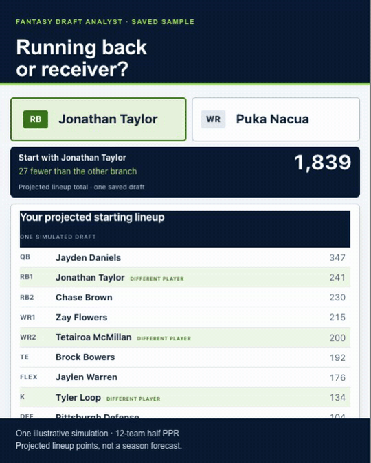

<h1 align="center">Fantasy Draft Analyst</h1>

<p align="center"><b>Don’t just rank players. Explore what your next pick does to the rest of your draft.</b></p>

<p align="center">Compare draft paths, understand the tradeoffs, and bring a plan to draft night.</p>

<p align="center">
<b><a href="https://nicodeguyo.github.io/fantasy-draft-analyst/">Explore the sample demo</a></b> ·
<b><a href="#setup">Make my draft plan</a></b>
</p>

<p align="center"><a href="https://nicodeguyo.github.io/fantasy-draft-analyst/"></a></p>

<p align="center">Free, open-source project · No account needed for the demo · No coding needed for the guided setup</p>

The board is prepared **before your draft** using your scoring, draft slot, roster rules, and keepers. During the draft, tap to cross off taken players and fill your lineup. **Those taps do not rerun simulations or recalculate recommendations.**

The demo uses a fictional 12-team ESPN half-PPR keeper league with saved 2026 player data. It is an example, not a live feed or advice tailored to your league. [View or download the sample HTML board](examples/sample-league/draft-board.html).

**Useful for your draft? [Star the repo](https://github.com/nicodeguyo/fantasy-draft-analyst) so you can find it again, and share the demo with a friend.**

## What you get

- **A pick-by-pick plan.** Compare players by the projected starting lineup you could finish with. `TAKE` marks the recommendation; `−14` means an estimated 14 fewer projected lineup points across the season if you choose that alternative.
- **See when targets tend to go.** Explore pre-draft availability at your picks and the modeled drop in available talent at each position. These frequencies do not update when you mark picks.
- **Keeper decisions explained.** Compare keepers against each other and keeping nobody, including the draft pick each costs. The simulator supports zero or one keeper per team.
- **Your shortlist, checked.** Ask the assistant to verify the role, injury, and usage claims behind the players you like, with dated sources and an honest bear case.
- **A board for your phone.** Download one HTML file, track picks manually, and keep your lineup visible. Picks are saved in that browser when local storage is available.

<p align="center"></p>

## Setup

**New to AI tools? Start with Claude in your browser.** The download is a *skill*: a package of instructions and scripts that teaches the assistant how to research your league and run the simulator. You describe your league in ordinary language; Claude runs the code.

1. [Follow the upload guide](docs/install.md#claude-in-your-browser-recommended) to enable code execution and upload the [packaged skill](https://github.com/nicodeguyo/fantasy-draft-analyst/raw/refs/heads/main/dist/fantasy-draft-analyst.zip).
2. Paste the league description below, replacing the brackets. “I don't know” is fine; ask Claude to help you find the setting.
3. Review the league settings and data dates, then ask Claude to generate your analysis and downloadable HTML board. Open the board before draft night and try marking a pick.

The project is free. Creating your own plan requires an assistant account and sufficient usage; its plan limits apply. Claude's upload route requires code execution. [Current prerequisites and alternatives](docs/install.md).

```text
Use the fantasy draft analyst skill to make my draft plan.
Ask me about missing settings before you simulate.

Season and draft date: [2026, date and time zone]
Platform: [ESPN / Yahoo / Sleeper / other]
League size: [number of teams]
Draft order: [snake / linear], my pick: [number], rounds: [number]
Scoring: [standard / half-PPR / PPR]
Passing TDs: [4 or 6], interceptions: [penalty]
Other scoring: [bonuses, TE premium, or none]
Starting lineup: [QB, RB, WR, TE, FLEX, superflex, K, DEF counts]
Bench spots: [number]
Keepers: [none, or number allowed and cost rules]
My keeper options: [player and round cost, or none]
Known league keepers: [draft slot, player, round cost for each; or unknown]
Players I like or want to avoid: [names and why, or none]
Draft-room tendencies: [anything I know, or unknown]
Board colors: [favorite NFL team or colors]

Use current public data and show the date and source for each input.
Tell me if any data is unavailable or any result is only an approximation.
Give me keeper advice if relevant, a pick-by-pick plan, the cost of
waiting, and a downloadable HTML board. Explain the assumptions and
which changes would alter your recommendation. Do not use the sample
league's saved player data as current data for my league.
```

Already use a coding assistant? See [Claude Code](docs/install.md#claude-code), [Codex or another coding assistant](docs/install.md#codex-or-another-coding-assistant), or [run the scripts yourself](docs/install.md#running-the-scripts-yourself). For chat without code execution, use the [paste-anywhere prompt](prompt/fantasy-draft-analyst-prompt.md); that route provides an analytical approximation, not the full simulation.

## Test the strategy, not just the rankings

<!-- benchmark:start -->
Across 800 simulated drafts, the saved-board policy produced 90 more projected starting-lineup points than the noisy ADP-based draft bot, on average.

| Drafting policy | Mean projected lineup total |
|---|---:|
| Noisy ADP-based draft bot | 1,761 |
| Saved-board policy | 1,851 |
| Adaptive heuristic | 1,864 |

**Internal simulation, not real-season results.** The metric is the sum of projections for one best legal starting lineup. The paired difference is +90.1 ± 3.5 points (approximately 95% Monte Carlo interval). This interval excludes projection and model uncertainty. Weekly substitutions, injury coverage and bench value are not scored. The baseline is our noisy ADP-based draft bot, not verified platform autopick.

The benchmark follows the same saved player order and documented fallback as the displayed board. It does not model every choice a human user might make. [Exact results and input hashes](examples/sample-league/benchmark.json).
<!-- benchmark:end -->

The repository includes a reproducible policy benchmark: the prepared board, a noisy ADP-based draft bot, and the simulator’s adaptive policy draft against the same opponent model. The board policy follows the displayed ordering, roster constraints, and documented late-round fallback.

The score is the **sum of season projections for one best legal starting lineup**. This is an internal simulation comparison, not a real-season backtest or a test against a platform’s actual autopick. Weekly substitutions, injuries, waivers, and the insurance value of the bench are outside that score. Shared seeds couple randomness; the resulting draft rooms can diverge after different picks. [Reproduce the comparison](#reproduce-every-number).

## Make your next pick fit the rest of your draft

The difficult part of a draft is choosing between good players while building a complete team.

Taking a running back now changes the receivers you can target later. Your scoring, draft slot and keeper change those tradeoffs, too.

Fantasy Draft Analyst plays out possible drafts and turns that analysis into a plan: targets, backups and a board you can bring to draft night.

Try the [saved example](https://nicodeguyo.github.io/fantasy-draft-analyst/#compare) to see two paths from the same starting draft room. Then [build a plan for your league](#setup).

The method depends on projections, modeled opponents, and the policy making later picks. You can inspect those choices and challenge the result. Read [how it works](docs/how-it-works.md), the [interactive demo methodology](docs/site/README.md), the [worked analysis](examples/sample-league/analysis.md), and the [run log with data sources](examples/sample-league/RUNLOG.md).

## What it handles

| Setting | Support |
|---|---|
| Drafts | Snake and linear; redraft and keeper leagues |
| Scoring | Standard, half-PPR, PPR, passing-TD settings, bonuses, TE premium |
| Lineups | QB / RB / WR / TE / K / DEF, FLEX, superflex |
| Keepers | Zero or one per team, with a round cost; compare eligible user candidates and keeping nobody; known keepers use explicit draft slots |
| Platforms | Platform-specific average draft position (ADP), when usable public data is available |

Auction has a pricing approximation in the methodology, **not a bidding simulator**. Multi-keeper optimization, best ball’s weekly scoring, and dynasty are outside the model’s scope. Unusual rules and data sources may require adjustments; the assistant should identify those before promising a complete plan.

## Reproduce every number

Requires Python 3.10+ and PyYAML. From the repository root, create an environment and reproduce the benchmark against the committed sample inputs:

```bash
python3 -m venv .venv
source .venv/bin/activate
python -m pip install pyyaml
python scripts/compare_policies.py \
  --league examples/sample-league/league.yaml \
  --players examples/sample-league/players.csv \
  --sim examples/sample-league/sim.json \
  --drafts 800
```

On Windows, activate with `.venv\Scripts\Activate.ps1` in PowerShell instead. To regenerate the sample simulation:

```bash
python skills/fantasy-draft-analyst/scripts/draft_sim.py \
  --league examples/sample-league/league.yaml \
  --players examples/sample-league/players.csv \
  --sims 1500 --pick-values --keeper-scenarios \
  --out /tmp/fantasy-sample-sim.json
```

**Same saved inputs and seed, same output.** The full sample run was verified byte-for-byte against the committed simulation JSON, availability CSV, and regenerated HTML board on Python 3.14.6 with PyYAML 6.0.3. This reproduces the saved example; fetching newer player data intentionally changes the result.

Use a writable output path on your computer (for example `fantasy-sample-sim.json` on Windows). This can take several minutes; runtime depends on hardware. `--rollouts 60` gives a quicker, rougher run and changes the output. See the [full script guide](docs/install.md#running-the-scripts-yourself) and [sample run log](examples/sample-league/RUNLOG.md) for provenance and settings.

## Where it can be wrong

- **Projections are assumptions.** Confident simulation results can still be wrong if player projections or the model of your draft room are wrong.
- **The board is a prepared plan.** Its recommendations and availability percentages do not update when you mark picks. An unexpected draft can make the plan less useful.
- **Later simulated picks use a heuristic.** That decision rule influences the value assigned to each candidate. The sample board trails the model's adaptive policy by 26 projected points in the internal comparison.
- **Freshness depends on the run.** The assistant researches data when you ask it to; saved boards do not refresh themselves. Check dates and rerun before your draft when injuries or roles change.

## FAQ

**Do I need to code?** No for the recommended Claude upload route. You need an assistant that can execute the bundled scripts to get the full simulation and board.

**Does this connect to my live draft?** No. You manually mark picks. It does not log into your league or sync with ESPN, Yahoo, or Sleeper.

**Redraft with no keepers?** Yes. Say “no keepers” in your league description.

**Can I share my board?** Yes. The HTML file contains your plan, so share it only with people you want to see your strategy. The public demo is safe to share as an example.

**How do I get help?** [Report a bug or setup problem](https://github.com/nicodeguyo/fantasy-draft-analyst/issues/new/choose) with a small example. You do not need to publish your private league details.

## Contributing

Useful contributions include verified public data sources, supported examples for more league formats, clearer setup instructions, and improvements to the model's later-pick policy. See [CONTRIBUTING.md](CONTRIBUTING.md) and the [changelog](CHANGELOG.md).

## Credits

<p align="center">
<a href="https://github.com/nicodeguyo/fantasy-draft-analyst/stargazers"></a>
<a href="LICENSE"></a>


</p>

Built by Nico Neugebauer ([@nicodeguyo](https://github.com/nicodeguyo)) with Claude, for his own 14-team keeper league, then generalized. The projections, simulations and opinions are the model's; the players are real; the leagues in the examples are not. Not affiliated with the NFL, ESPN, Yahoo, Sleeper or any sportsbook. Data sources belong to their owners; respect their terms.

[MIT License](LICENSE). Use it, inspect it, improve it.
